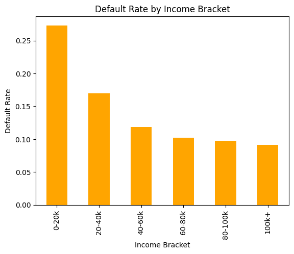
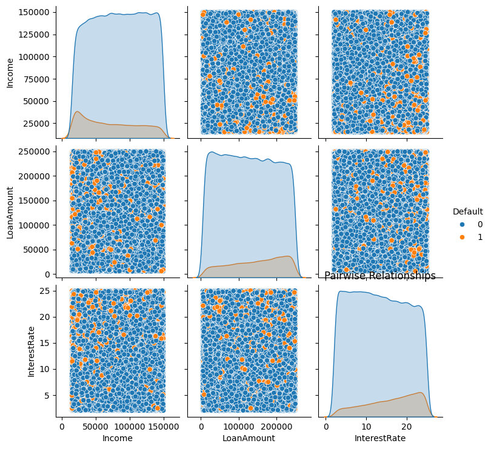
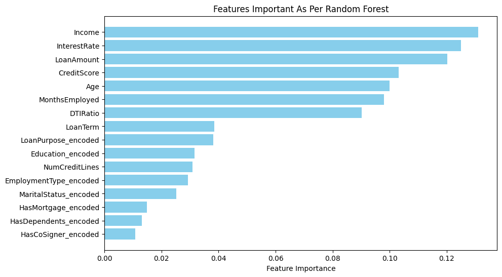
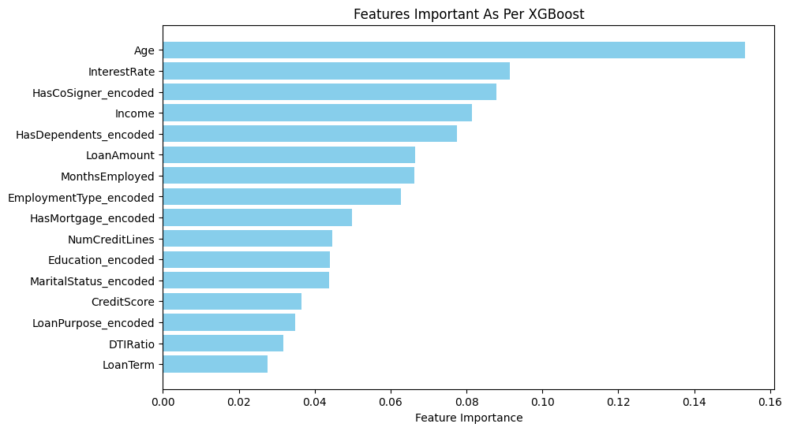

# Loan Default Prediction App  

## Overview

This web app predicts the likelihood of a loan default based on user inputs such as Age, Income, Loan Amount, and other relevant features. It uses machine learning models including XGBoost and Random Forest to provide predictions. The system features real-time risk prediction via Streamlit, with data preprocessing and feature engineering applied to improve model accuracy. Retrieval-Augmented Generation (RAG) is used to fetch relevant resources based on user input, which are then processed by GPT to produce clear, human-readable risk explanations. CI/CD is implemented through GitHub Actions, with Dockerized deployment on AWS for scalability and reliability. The app includes a user-friendly interface for efficient risk assessment. 

## Features  

- **User-friendly Interface**: Enter key details (age, income, loan amount, etc.) via a simple form.  
- **Multiple Model Predictions**: Get predictions from two distinct models for robust results:  
  - **XGBoost**  
  - **Random Forest**
- **Real-Time Results**: Receive immediate predictions and updates as you enter data.  
- **Clear Explanations**: Understand the reasoning behind predictions with AI-powered, easy-to-understand insights.  
- **Business Insights**: Access strategic recommendations to help improve lending decisions.


## Model Performance

**XGBoost**

**Accuracy**: 88.59%

### Classification Report:
| Class | Precision | Recall | F1-Score | Support |
|-------|-----------|--------|----------|---------|
| 0     | 0.89      | 0.99   | 0.94     | 45170   |
| 1     | 0.54      | 0.09   | 0.15     | 5900    |

**Accuracy**: 0.89 (51070 samples)  
**Macro avg**: 0.72 Precision, 0.54 Recall, 0.54 F1-Score (51070 samples)  
**Weighted avg**: 0.85 Precision, 0.89 Recall, 0.85 F1-Score (51070 samples)

### Confusion Matrix:

|           | Predicted 0 | Predicted 1 |
|-----------|-------------|-------------|
| **Actual 0** | 44737       | 433         |
| **Actual 1** | 5396        | 504         |

**Random Forest**

**Accuracy**: 88.68%

### Classification Report:
| Class | Precision | Recall | F1-Score | Support |
|-------|-----------|--------|----------|---------|
| 0     | 0.89      | 1.00   | 0.94     | 45170   |
| 1     | 0.64      | 0.05   | 0.09     | 5900    |

**Accuracy**: 0.89 (51070 samples)  
**Macro avg**: 0.76 Precision, 0.52 Recall, 0.51 F1-Score (51070 samples)  
**Weighted avg**: 0.86 Precision, 0.89 Recall, 0.84 F1-Score (51070 samples)

### Confusion Matrix:

|           | Predicted 0 | Predicted 1 |
|-----------|-------------|-------------|
| **Actual 0** | 45011       | 159         |
| **Actual 1** | 5621        | 279         |


- **Real-time Predictions**: Receive immediate loan default predictions based on your input.

## Sample Output

After entering loan details and clicking the **Submit** button (this is a sample case), the app displays an AI-powered risk analysis like this:

🤖 **AI-Powered Risk Analysis**  
Based on the input data, the predicted chance of default is **5.30%**.

This is considered a **Low Risk** loan. The applicant demonstrates strong indicators for repayment, such as a good credit score and stable income.

📚 **Relevant Information for Your Situation**  
📊 **Risk Level:** Low (5.3% chance of default)

✅ **Factors Supporting This Application:**  
- 📖 Debt-to-Income (DTI) Impact  
- 📖 Education & Financial Literacy  
- 📖 Co-Signer Benefits

✅ **Low Risk:** This application shows good indicators for successful loan repayment.

## Visualizations

To better understand the dataset and model performance, the following visualizations can be included:  


1. **Default Rate Vs Income Bracket**: A histogram to visualize how different loan amounts correlate with default rates.


2. **Pairwise Relationship Pairplot**: A pair plot using Seaborn to visualize the pairwise relationships between Income, Loan Amount, Interest Rate, and Default status, with different colors representing default vs. non-default cases.


3. **Feature Importance** (for XGBoost and Random Forest): The list of features that are important as per both the algorithms - Random Forest and XGBoost.



## Installation  

1. Clone this repository:  
   ```bash
   git clone https://github.com/sharmaraghav644/loandefaultpredictionapp
   ```
2. Install packages from packages.txt file:
   ```bash
   sudo xargs -a packages.txt apt-get install -y
   ``` 
3. Install the necessary dependencies:  
   ```bash
   pip install -r requirements.txt
   ```  
4. Run the Streamlit app:  
   ```bash
   streamlit run app.py
   ```  

## How to Use  

1. Enter details about the loan and borrower (e.g., Age, Income, Loan Amount).  
2. Select categorical options (e.g., Education, Employment Type).  
3. Click **Submit** to view the loan default likelihood for each model.  

## Models Used  

- **XGBoost**: A powerful gradient boosting model.  
- **Random Forest**: A robust ensemble learning method.  

## Data Source  

The dataset used in this project is **Loan Default Prediction Dataset**. You can access it on Kaggle here: [Dataset Link](https://www.kaggle.com/datasets/nikhil1e9/loan-default/data).  

## Dependencies  

All required dependencies are listed in the `requirements.txt` file in this repository. The list excludes dependencies that are pre-installed in Streamlit.  

## Author  

**Raghav Sharma**  

## License  

MIT License  
